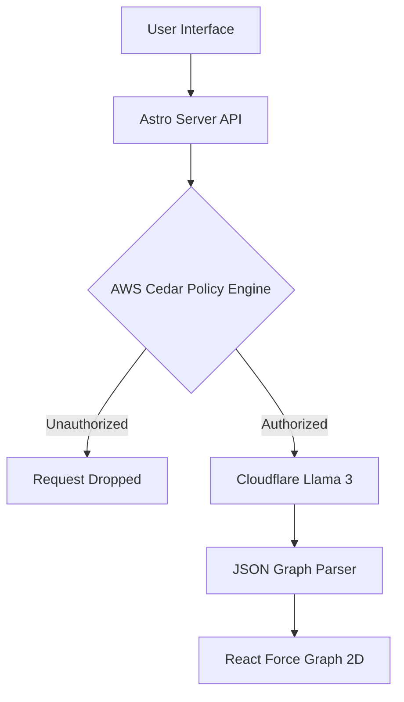

<div align="center">
  <h1>DeepGraph AI</h1>
  <p><b>Zero-Trust Knowledge Graph Extraction</b></p>
  <p>Built for the <b>First Commit Hackathon (Bharat Builds Tour)</b></p>
</div>

---

## The Problem & Solution

Researchers, software architects, and legal teams waste hours trying to map out relationships in dense, unstructured text. 

**DeepGraph AI** solves this by instantly transforming complex paragraphs into interactive, visual Knowledge Graphs. Simply paste your text, and our system extracts the entities and relationships, rendering them in a dynamic physics-based 2D canvas.

## Hackathon Alignment (Build It Track)

This project was engineered specifically for the **Build It** track, adhering to the open-source, serverless, and zero-cost constraints:

* **AWS Cedar (The AWS Open Source Requirement):** We implemented the `@cedar-policy/cedar-wasm` SDK. Before any AI extraction occurs, the API payload is evaluated locally against a zero-trust policy engine using AWS Cedar. This robust policy-as-code integration fulfills the AWS tooling requirement entirely on `localhost`.
* **Cloudflare Workers AI:** Once authorized by Cedar, the request is passed to Cloudflare's cutting-edge **Llama-3-8B-Instruct** model via API to perform lightning-fast, zero-shot Named Entity Recognition (NER) and relationship mapping.

## System Architecture



## Key Features

* **Instant Extraction:** Drop in any complex text and get a mapped structural graph instantly.
* **Zero-Trust Security:** API routes are guarded by strict AWS Cedar policy-as-code evaluations.
* **Interactive Visualization:** Physics-based node dragging, zooming, and panning.
* **Modern Stack:** Built on Astro, React, and Tailwind CSS for blistering fast performance.

## Local Development

### 1. Prerequisites
- Node.js (v18+)
- Cloudflare API Token (with access to Workers AI)

### 2. Quickstart
Clone the repository and move into the directory:
```bash
git clone https://github.com/Tech-no-mad/DEEPGRAPH.git
cd DEEPGRAPH
```

Create a `.env` file in the root directory with your credentials:
```env
CLOUDFLARE_ACCOUNT_ID=your_account_id_here
CLOUDFLARE_API_TOKEN=your_api_token_here
```

Install the dependencies and start the local development server:
```bash
npm install
npm run dev
```

Visit `http://localhost:4321` in your browser to interact with the AI.
