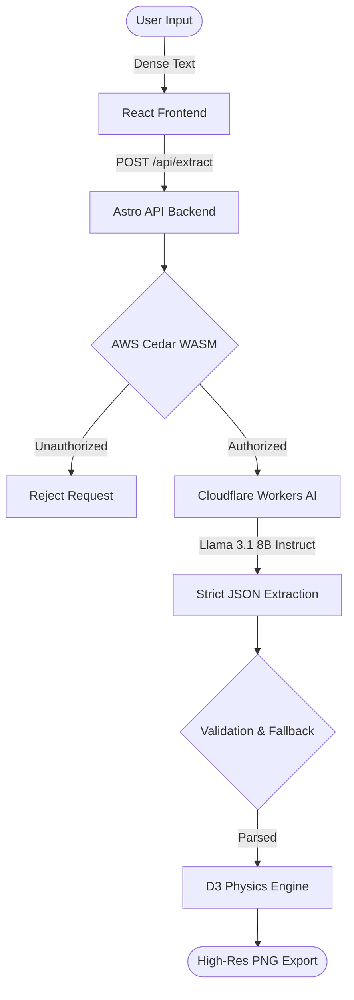

# DeepGraph AI

**Zero-Trust Knowledge Graph Extraction in Milliseconds**

DeepGraph AI transforms dense, unstructured text (contracts, research papers, tech news) into interactive, highly readable Knowledge Graphs. Powered by Cloudflare's Llama 3.1 AI and secured locally by AWS Cedar Zero-Trust policies.

Built for the **First Commit Hackathon 2026**.

## 🚀 Key Features

- **Contextual Entity Resolution:** The AI automatically resolves pronouns and deduplicates entities to ensure a mathematically clean graph.
- **Advanced D3 Physics Engine:** Custom auto-untangling physics, massive node repulsion, and smart auto-zooming ensure the graph is always perfectly readable and never overlaps.
- **Drag & Lock Layouts:** Drag any node to permanently freeze it in place, allowing you to manually arrange the perfect presentation graph.
- **One-Click PNG Export:** Instantly download a high-resolution, dark-mode image of your knowledge graph directly from the HTML5 Canvas.
- **Zero-Trust Security:** Integrates AWS Cedar to authorize AI inference requests locally, ensuring strict access control before any data hits the LLM.
- **Strict AI Determinism:** Enforces `temperature: 0.0` and a strict 3-word relationship limit to guarantee consistent, hallucination-free data extraction.

## 🏗️ System Architecture



## 🛠️ Tech Stack

- **Frontend:** Astro, React, Tailwind CSS
- **Graph Visualization:** react-force-graph-2d (HTML5 Canvas)
- **AI Engine:** Cloudflare Workers AI (`@cf/meta/llama-3.1-8b-instruct-fp8`)
- **Security:** AWS Cedar (`@cedar-policy/cedar-wasm`)

## ⚙️ Running Locally

1. Clone the repository
2. Install dependencies:
   ```bash
   npm install
   ```
3. Create a `.env` file in the root directory:
   ```env
   CLOUDFLARE_ACCOUNT_ID=your_account_id
   CLOUDFLARE_API_TOKEN=your_api_token
   ```
4. Start the development server:
   ```bash
   npm run dev
   ```
5. Open `http://localhost:4321` in your browser.

## 🔒 AWS Cedar Implementation (Hackathon Track)

This project qualifies for the AWS open-source track by implementing **AWS Cedar** via WebAssembly (`cedar-wasm`). Before any text is sent to the Cloudflare LLM, a local Cedar policy engine evaluates the request to guarantee the user has the `Action::"ExtractGraph"` permission under the Zero-Trust architecture.
